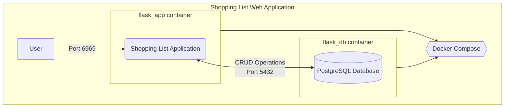

# Shopping List

## Description

A shopping list that stores items that user wants to buy in a Database.
It is also run as containers through docker compose.

### Folders

"static" folder: contains CSS styles and images.

"templates" folder: holds HTML files for webpages.

"app.py": main code for running Flask and managing the database.

"docker-compose.yaml": code for configuring Docker Compose.

"Dockerfile": code for creating a Docker image.

"requirements.txt": a text file listing all dependencies required to run your application.

## Requirements

- Python 3
- Pip
- Docker Desktop

## Usage

```linux
# build the docker compose
docker-compose build

# runs the containers of app and db (-d means detached)
docker compose up [-d]

# stop running the containers and remove the network for shopping list
docker compose down

```

## System Diagram


## Contributing

Contributions to the Shopping List project are welcomed. If you plan to make significant changes, please open an issue first to discuss the proposed modifications. 
Additionally, ensure that you update the relevant tests to maintain code integrity.

## Authors

The Shopping List application is maintained by cadzchua.

## License

This project is licensed under the [MIT](https://choosealicense.com/licenses/mit/). You are free to use, modify, and distribute the software as per the terms of the license agreement.
